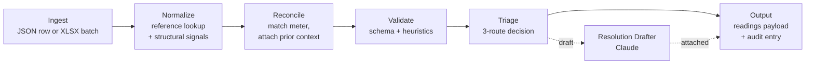

# Utility Bill Ingestion & Quality Assurance Pipeline

An AI-augmented prototype of the layer that sits **upstream** of a customer-facing utility data product. It takes messy utility bill data — single rows or batch uploads from many sources — normalizes it against a reference library, reconciles it against existing meter history, validates it against a schema and a small set of domain heuristics, and then decides per-record whether the bill auto-resolves, gets a Claude-drafted resolution proposal for human review, or escalates to a routed team queue. Every step is logged to an audit trail.

The prototype is conceptually positioned upstream of [Measurabl's Data Manager](https://support.measurabl.com): it is the ingestion-and-triage layer that decides what gets written to the canonical readings table in the first place. It is not a replacement for Data Manager and never implies that it is. The goal is to demonstrate a defensible architectural approach to the operational problem Measurabl's back-office team runs every day — and the engineering discipline that would scale that approach across a distributed team.

---

## Architecture



Every stage produces an artifact the next stage consumes. Every stage is independently testable. Every artifact is serializable and inspectable. The Claude call lives in exactly one place — the Resolution Drafter — and it is gated on human approval, never auto-applied.

---

## Run the demo

The fastest way to see the pipeline do real work is the canonical-bill harness. It walks six curated bills through the system end-to-end (six because that is how many it takes to touch every triage route and the human-review loop both ways). It runs against the live Anthropic API on the DraftForHumanReview cases.

```bash
git clone <this repo>
cd utility-bill-pipeline
python -m venv .venv && .venv/Scripts/activate          # Windows
# python -m venv .venv && source .venv/bin/activate     # macOS / Linux
pip install -e ".[dev]"
export ANTHROPIC_API_KEY=sk-ant-...                     # required for the drafter
python -m src.db.seed --reset                           # reset prototype.db to fixtures
uvicorn src.main:app --reload                           # in one terminal
python scripts/demo.py --auto-approve                   # in another
```

`--auto-approve` runs hands-off and approves every drafted resolution automatically. Use `--interactive` to pause at each DraftForHumanReview case with an `[A]pprove / [R]eject / [S]kip` prompt — that mode is the one to use during a live walkthrough.

The same six cases are documented in [WALKTHROUGH.md](WALKTHROUGH.md) for readers who would rather follow along than run the code.

---

## Read the design

Three documents carry the reasoning behind the build. They are deliberately separated by audience and lifecycle:

| Document | Audience | Purpose |
|---|---|---|
| [DESIGN.md](DESIGN.md) | engineering | The authoritative spec. Architecture, decisions, build plan. Changes deliberately. |
| [WALKTHROUGH.md](WALKTHROUGH.md) | operations + portfolio readers | Six canonical bills explained case by case. Mirrors the demo harness. |
| [DECISIONS.md](DECISIONS.md) | engineering + audit reader | ADRs for every significant choice, with rationale and alternatives. |
| [CLAUDE.md](CLAUDE.md) | the next engineer | Working memory: what exists right now, what the rules are. Updated every commit. |
| [TASKS.md](TASKS.md) | the next engineer | Live backlog with commit hashes. One task per commit. |

A companion **scale-to-production document** is drafted alongside this prototype and takes every feature that was deliberately cut (PDF extraction, AutoEstimate triage, statistical anomaly detection, the tariff-aware reference store, multi-tenant isolation, real auth and queues) and articulates what it becomes at tens of thousands of bills per month, distributed teams, real persistence, real observability, real SLAs. That document is the artifact that signals enterprise-grade thinking; this repository is the spine the scale doc points back at.

---

## What this is not

This is a **prototype**, not a production system. It is built in twenty focused hours against a deliberate cut list, documented in DESIGN.md §5. The cuts are not omissions — they are first-class architectural decisions, each treated in the scale-to-production document. The prototype's job is to prove the spine: messy input on the left, structured triage with audit on the right, a Claude call sitting in exactly one place where it earns its place. The production version is what the scale doc covers.

The methodology artifacts ([CLAUDE.md](CLAUDE.md), [DECISIONS.md](DECISIONS.md), [TASKS.md](TASKS.md)) are not show-pieces. They are the operations system a distributed engineering team would actually use to maintain and extend this system; the FormulationImpactAPI project that this build inherits the pattern from demonstrated it under load.

---

## Status

Phase 3 — Triage, Drafter, and the human-approval loop are wired and tested. The demonstration harness ([scripts/demo.py](scripts/demo.py)) and the walkthrough document ([WALKTHROUGH.md](WALKTHROUGH.md)) are in place. Remaining for Phase 3: the XLSX batch endpoint. Phase 4 — walkthrough prep — is next.

See [TASKS.md](TASKS.md) for the live backlog and [CLAUDE.md](CLAUDE.md) for what currently exists.
