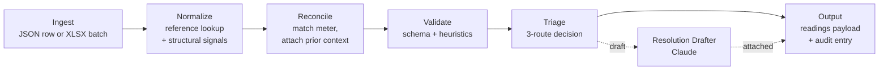

# Utility Bill Ingestion & Quality Assurance Pipeline

An AI-augmented prototype of the layer that sits **upstream** of a customer-facing utility data product. It takes messy utility bill data — single rows or batch uploads from many sources — normalizes it against a reference library, reconciles it against existing meter history, validates it against a schema and a small set of domain heuristics, and then decides per-record whether the bill auto-resolves, gets a Claude-drafted resolution proposal for human review, or escalates to a routed team queue. Every step is logged to an audit trail.

The prototype is conceptually positioned upstream of [Measurabl's Data Manager](https://support.measurabl.com): it is the ingestion-and-triage layer that decides what gets written to the canonical readings table in the first place. It is not a replacement for Data Manager and never implies that it is. The goal is to demonstrate a defensible architectural approach to the operational problem Measurabl's back-office team runs every day — and the engineering discipline that would scale that approach across a distributed team.

---

## Architecture



Every stage produces an artifact the next stage consumes. Every stage is independently testable. Every artifact is serializable and inspectable. The Claude call lives in exactly one place — the Resolution Drafter — and it is gated on human approval, never auto-applied.

---

## Run the demo

The fastest way to see the pipeline do real work is the canonical-bill harness. It walks six curated bills through the system end-to-end (six because that is how many it takes to touch every triage route and the human-review loop both ways). It runs against the live Anthropic API on the DraftForHumanReview cases.

```bash
git clone <this repo>
cd utility-bill-pipeline
python -m venv .venv && .venv/Scripts/activate          # Windows
# python -m venv .venv && source .venv/bin/activate     # macOS / Linux
pip install -e ".[dev]"
export ANTHROPIC_API_KEY=sk-ant-...                     # required for the drafter
python -m src.db.seed --reset                           # reset prototype.db to fixtures
uvicorn src.main:app --reload                           # in one terminal
python scripts/demo.py --auto-approve                   # in another
```

`--auto-approve` runs hands-off and approves every drafted resolution automatically. Use `--interactive` to pause at each DraftForHumanReview case with an `[A]pprove / [R]eject / [S]kip` prompt — that mode is the one to use during a live walkthrough.

The same six cases are documented in [WALKTHROUGH.md](WALKTHROUGH.md) for readers who would rather follow along than run the code.

---

## How to read this repo

In order, depending on how much depth you want:

1. **This README** — what the project is, how to run it. ~60 seconds.
2. **[WALKTHROUGH.md](WALKTHROUGH.md)** — six canonical bills walked end-to-end, narrated for an operations reader. ~10 minutes.
3. **[DESIGN.md](DESIGN.md)** — the authoritative spec. Architecture, build plan, scope, what was deliberately cut and why. ~25 minutes.
4. **[DECISIONS.md](DECISIONS.md)** — every significant architectural choice as an ADR with rationale and alternatives. Skim the headings; depth-read the ones that catch your eye.
5. **The code** — start at [src/main.py](src/main.py), follow the routes, services, and stores. [CLAUDE.md](CLAUDE.md) is the live map of what exists where.

## Decisions of note

A short list of ADRs that best represent the architectural reasoning in this build:

- **[ADR-003](DECISIONS.md#adr-003--structural-only-confidence-model-no-llm-self-reported-confidence)** — Structural-only confidence model. The system never trusts an LLM's self-reported confidence. Confidence comes from observable checks (type, range, reference-library presence, cross-field agreement). This is the single most load-bearing decision in the build for the audience and the problem.
- **[ADR-007](DECISIONS.md#adr-007--stdlib-sqlite3-for-persistence-not-an-orm)** — Stdlib `sqlite3`, no ORM. Walking a reader through `store.py` is walking them through SQL, which is the point.
- **[ADR-009](DECISIONS.md#adr-009--drafter-system-prompt-lives-in-a-markdown-file-not-in-python)** — The drafter system prompt lives in a markdown file, not in Python. Editing it is a content change, not a code change; it reviews cleanly in `git diff`.
- **[ADR-010](DECISIONS.md#adr-010--drafter-uses-anthropic-tool-use-to-force-structured-output)** — Drafter uses Anthropic tool-use to force structured output. Schema enforcement on the server side, pydantic at the boundary, and a single tool name to anchor the system prompt.
- **[ADR-012](DECISIONS.md#adr-012--approval-applies-the-correction-directly-it-does-not-re-run-validation)** — Approval does not re-run validation. The human is the gate; re-running would loop the corrected bill back into the same flag.

## Phase status

| Phase | Status |
|---|---|
| Phase 1 — Foundation (repo + schema + fixtures + methodology) | Complete |
| Phase 2 — Single-Row Pipeline (ingest → normalize → reconcile → validate) | Complete |
| Phase 3 — Triage, Drafter, Demo harness, Logging, /status | Complete |
| Phase 4 — Walkthrough prep | In progress |

The XLSX batch endpoint (originally Phase 3) is moved to the scale-to-production companion document — the architectural lesson it would teach (queue-based fan-out, per-row idempotency, batch summary aggregation) is treated better there than rushed into the prototype. Everything cut from the prototype is named in DESIGN.md §5 with the engineering treatment it receives in the scale doc.

## Reference docs

| Document | Audience | Purpose |
|---|---|---|
| [DESIGN.md](DESIGN.md) | engineering | Authoritative spec. Architecture, decisions, build plan. Changes deliberately. |
| [WALKTHROUGH.md](WALKTHROUGH.md) | operations + portfolio | Six canonical bills explained case by case. Mirrors the demo harness. |
| [DECISIONS.md](DECISIONS.md) | engineering + audit reader | ADRs for every significant choice. |
| [CLAUDE.md](CLAUDE.md) | the next engineer | Working memory: what exists right now. Updated every commit. |
| [TASKS.md](TASKS.md) | the next engineer | Live backlog with commit hashes. |

A companion **scale-to-production document** is drafted alongside this prototype and takes every cut feature (PDF extraction, AutoEstimate, statistical anomaly detection, the tariff-aware reference store, multi-tenant isolation, real auth/queues, the XLSX batch path) and articulates what it becomes at tens of thousands of bills per month with distributed teams. That document is the artifact that signals enterprise-grade thinking; this repository is the spine the scale doc points back at.

---

## What this is not

This is a **prototype**, not a production system. It is built in twenty focused hours against a deliberate cut list, documented in DESIGN.md §5. The cuts are not omissions — they are first-class architectural decisions, each treated in the scale-to-production document. The prototype's job is to prove the spine: messy input on the left, structured triage with audit on the right, a Claude call sitting in exactly one place where it earns its place. The production version is what the scale doc covers.

The methodology artifacts ([CLAUDE.md](CLAUDE.md), [DECISIONS.md](DECISIONS.md), [TASKS.md](TASKS.md)) are not show-pieces. They are the operations system a distributed engineering team would actually use to maintain and extend this system; the FormulationImpactAPI project that this build inherits the pattern from demonstrated it under load.

---

## Operational visibility

Two endpoints surface the operational shape:

- **`GET /health`** — simple liveness probe. Returns `{"status": "ok", "version": ...}`.
- **`GET /status`** — read-only operational snapshot. Audit counts in the last 24h by triage route, pending drafted-for-review queue depth, last write timestamp, and whether the Anthropic key is configured (boolean — never the value).

Every pipeline stage emits a structured JSON log line to stdout (timestamp, level, service, stage, bill_ref, outcome, duration_ms). The drafter additionally logs the Anthropic model and the per-call token usage. The prototype uses stdlib `logging` plus a small JSON formatter — production observability (metrics, traces, sinks, correlation IDs) is treated in the scale-to-production document.

See [TASKS.md](TASKS.md) for the live backlog and [CLAUDE.md](CLAUDE.md) for what currently exists.
