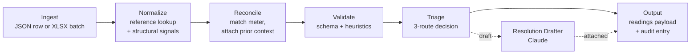

# Utility Bill Ingestion & Quality Assurance Pipeline

An AI-augmented prototype that ingests utility bill data, normalizes it against a reference library, reconciles it against meter history, validates it against schema and domain heuristics, and triages each record to AutoResolve, DraftForHumanReview, or Escalate — with a full audit trail.

This prototype sits conceptually upstream of Measurabl's Data Manager: it is the ingestion-and-triage layer that decides what gets written to the canonical readings table.

## Architecture



A polished diagram and per-stage narrative will live in [docs/architecture.md](docs/architecture.md).

## Quick start

```bash
python -m venv .venv
.venv\Scripts\activate          # Windows
# source .venv/bin/activate     # macOS/Linux
pip install -e ".[dev]"
pytest
uvicorn src.main:app --reload
```

Endpoints (see [DESIGN.md](DESIGN.md) §4 for full surface):

- `POST /bills` — single JSON row, returns the full pipeline result
- `POST /batches` — XLSX upload, returns a batch summary report

## Walkthrough script

A short, ordered tour of the system for the May 26 conversation. To be filled in during Phase 4. It will cover:

1. The six-stage decomposition at the architecture diagram
2. Three or four key decisions from [DECISIONS.md](DECISIONS.md)
3. Four sample scenarios end-to-end (one per triage outcome plus a clean batch)
4. The methodology artifacts as the operations system for distributed work
5. Where it goes next — pointer to the scale-to-production doc

## Status

Phase 1 — Foundation. Repo skeleton and methodology artifacts in place. Service code begins in Phase 2.

See [TASKS.md](TASKS.md) for the live backlog and [CLAUDE.md](CLAUDE.md) for current state.
